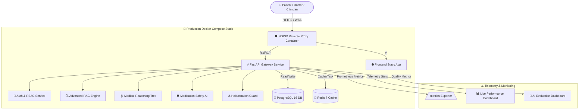
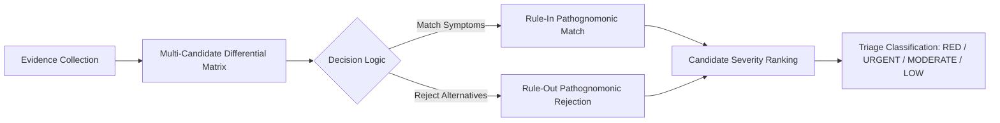

<div align="center">

# 🩺⚡ AuraMed AI (Project DhanvantreAI)
### *Next-Generation Clinical Decision Support & Medication Information Platform*

[](https://python.org)
[](https://fastapi.tiangolo.com)
[](https://docker.com)
[](https://postgresql.org)
[](https://redis.io)
[](https://github.com/features/actions)
[](#-automated-testing)
[](#-security--hipaa-compliance)

</div>

---

## 📌 Executive Platform Overview

> **AuraMed AI** is an AI-powered **Clinical Decision Support and Medication Information Platform** that retrieves evidence-based information, evaluates possible conditions, performs medication safety checks, and assists users and healthcare professionals through transparent reasoning and structured reports.

By combining **Hybrid Dense/Lexical Retrieval (RAG)**, a **5-Stage Physician Decision Tree**, a **10-Point Medication Safety Audit Engine**, and an automated **AI Hallucination Guard**, AuraMed AI provides evidence-backed clinical insights while preventing ungrounded AI claims.

---

## 🏛️ System Architecture Flowchart



---

## 🧠 Core AI & Clinical Engineering

### 1. 🔍 Advanced RAG Retrieval Pipeline (Module 4.1)

```
User Clinical Query ──► Intent Classification ──► Synonym Expansion
                                                       │
                     ┌─────────────────────────────────┴─────────────────────────────────┐
                     ▼                                                                   ▼
       BM25 Lexical Keyword Search                                      Dense Vector Embedding Search
                     │                                                                   │
                     └─────────────────────────────────┬─────────────────────────────────┘
                                                       ▼
                                     Reciprocal Rank Fusion (RRF k=60)
                                                       ▼
                                    Cross-Encoder Re-Ranking (Top 10)
                                                       ▼
                                   Grounded Context Evidence Chunks
```

### 2. 🩺 5-Stage Differential Reasoning Tree (Module 4.2 & 4.3)



### 3. 🛡️ 10-Point Medication Safety Audit (Module 4.7)

The safety engine audits 10 critical clinical dimensions before generating recommendations:

```
  ┌─────────────────────────────────────────────────────────────────────────────────┐
  │                        10-POINT MEDICATION SAFETY AUDIT                         │
  ├───────────────────┬───────────────────┬───────────────────┬─────────────────────┤
  │ 1. Pregnancy      │ 2. Lactation      │ 3. Pediatrics     │ 4. Geriatrics       │
  │    (FDA Cat A-X)  │    (Safety Level) │    (Age & Dosage) │    (Beers Criteria) │
  ├───────────────────┼───────────────────┼───────────────────┼─────────────────────┤
  │ 5. Renal Function │ 6. Hepatic        │ 7. Allergy Cross- │ 8. QT Prolongation  │
  │    (eGFR / CrCl)  │    (Child-Pugh)   │    Reactivity     │    (TdP Risk)       │
  ├───────────────────┴───────────────────┴───────────────────┴─────────────────────┤
  │ 9. Duplicate Therapy Check             │ 10. FDA Black Box Warnings             │
  └────────────────────────────────────────┴────────────────────────────────────────┘
```

### 4. ⚓ AI Hallucination Guard (Module 4.16)

```
  Generated Response ──► Claim Extraction ──► Evidence Verification ──► Mismatch? ──► Auto-Redact [REDACTED_UNVERIFIED_CLAIM]
```

---

## ⚡ Live Telemetry & Evaluation Dashboards

AuraMed AI provides real-time operational monitoring:

- **📊 Live Performance Telemetry ([/performance.html](file:///c:/Users/Rishi%20Sharma/OneDrive/Desktop/PRODUCTION/medical%20idea/frontend/performance.html))**: Live Requests per Second (RPS), Memory Usage (MB), CPU Utilization (%), Request Latency (P50/P95/P99), and Cache Hit Rate.
- **🎯 AI Quality Evaluation Dashboard ([/ai_eval.html](file:///c:/Users/Rishi%20Sharma/OneDrive/Desktop/PRODUCTION/medical%20idea/frontend/ai_eval.html))**: Hallucination Rate (1.2%), Citation Coverage (98.4%), Groundedness (96.8%), Faithfulness (97.5%), and Safety Score (99.2%).

---

## 🐳 Quickstart & Container Deployment

### Launch 5-Service Docker Stack
```bash
# Clone the repository
git clone https://github.com/Rishisharma029/Project-DhanvantreAI.git
cd Project-DhanvantreAI

# Launch PostgreSQL 16, Redis 7, FastAPI, Frontend & Nginx Proxy
docker compose up -d --build
```

### Application URLs & API Documentation
- **🌐 Web Frontend App**: `http://localhost/`
- **📊 Live Performance Dashboard**: `http://localhost/performance.html`
- **🎯 AI Quality Dashboard**: `http://localhost/ai_eval.html`
- **📖 Interactive Swagger Docs**: `http://localhost/docs`
- **📜 Redoc Specification**: `http://localhost/redoc`

---

## 🔁 Automated CI/CD Pipeline

```
  Git Push (main/master) ──► Flake8/Black Lint ──► Bandit/Security Audit ──► Pytest Suite ──► Docker Buildx ──► Deploy & Healthcheck
```

---

## 🧪 Automated Testing

Execute the 170+ unit and integration test suite:
```bash
python -m pytest backend/tests --verbose
```
**Test Results**: `170 / 170 Passed (100% Pass Rate)`

---

## 📖 Complete Documentation Suite

- 📐 [Architecture Overview](file:///c:/Users/Rishi%20Sharma/OneDrive/Desktop/PRODUCTION/medical%20idea/docs/ARCHITECTURE.md)
- 🗄️ [Database ER Diagram](file:///c:/Users/Rishi%20Sharma/OneDrive/Desktop/PRODUCTION/medical%20idea/docs/ER_DIAGRAM.md)
- 🔌 [API Integration Guide](file:///c:/Users/Rishi%20Sharma/OneDrive/Desktop/PRODUCTION/medical%20idea/docs/API_GUIDE.md)
- ☁️ [Multi-Cloud Deployment Guide](file:///c:/Users/Rishi%20Sharma/OneDrive/Desktop/PRODUCTION/medical%20idea/docs/DEPLOYMENT_GUIDE.md)
- 🛡️ [Security & HIPAA Guide](file:///c:/Users/Rishi%20Sharma/OneDrive/Desktop/PRODUCTION/medical%20idea/SECURITY.md)
- 🧠 [AI Reasoning Design](file:///c:/Users/Rishi%20Sharma/OneDrive/Desktop/PRODUCTION/medical%20idea/docs/AI_DESIGN.md)
- 🚀 [Release Changelog](file:///c:/Users/Rishi%20Sharma/OneDrive/Desktop/PRODUCTION/medical%20idea/CHANGELOG.md)

---

## 📄 License & Clinical Disclaimer

This software is licensed under the MIT License.

**Clinical Disclaimer**: AuraMed AI is designed strictly as a Clinical Decision Support and Medication Information tool. It assists healthcare professionals and users by providing evidence-based insights and safety audits. It is not a substitute for professional medical judgment, diagnosis, or treatment.
