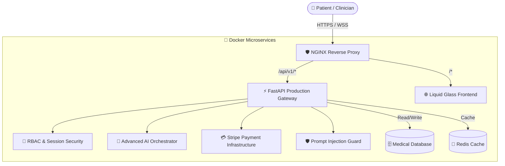

<div align="center">

# 🩺⚡ AuraMed AI (Project DhanvantreAI)
### *Professional-Grade Clinical Decision Support & Medication Intelligence Platform*

[](https://rishisharma029.github.io/Project-DhanvantreAI/)
[](https://python.org)
[](https://fastapi.tiangolo.com)
[](https://docker.com)
[](#-production-security--hardening)
[](#-automated-testing)
[](https://github.com/features/actions)

</div>

---

## 🌐 Live Production Demo

Explore the live static frontend application featuring modern glassmorphism and dynamic UI enhancements:
👉 **[Launch Live Demo: https://rishisharma029.github.io/Project-DhanvantreAI/](https://rishisharma029.github.io/Project-DhanvantreAI/)**

- **Interactive AI Medical Chat**: [chat.html](https://rishisharma029.github.io/Project-DhanvantreAI/chat.html)
- **Clinical Dashboard**: [dashboard.html](https://rishisharma029.github.io/Project-DhanvantreAI/dashboard.html)
- **Medication Safety & Triage**: [medicines.html](https://rishisharma029.github.io/Project-DhanvantreAI/medicines.html)

---

## 📌 Executive Platform Overview

> **AuraMed AI** is a production-ready **Clinical Decision Support and Medication Information Platform**. It leverages advanced AI to retrieve evidence-based medical data, evaluate complex clinical conditions, perform multi-point medication safety audits, and assist healthcare professionals with transparent, grounded reasoning.

The platform integrates **Hybrid Dense/Lexical Retrieval (RAG)**, a **5-Stage Physician Decision Tree**, and a **Production-Grade Security Suite** to provide accurate clinical insights while maintaining the highest standards of data integrity and patient safety.

---

## 🏛️ System Architecture



---

## 🧠 Core AI & Clinical Engineering

### 1. 🔍 Advanced Multi-Modal AI Pipeline
*   **Document AI**: Automated extraction of lab entities from prescriptions and reports (CBC, Thyroid, etc.) with strict MIME and extension validation.
*   **Voice AI**: Real-time symptom analysis via voice interaction, integrated with core disease prediction engines.
*   **Image AI**: Multi-modal analysis for skin rashes and wound progression with built-in non-definitive clinical disclaimers.

### 2. 🩺 5-Stage Differential Reasoning Tree
The system follows a structured clinical path: **Evidence Collection** → **Differential Matrix** → **Rule-In/Rule-Out Logic** → **Severity Ranking** → **Triage Classification** (RED / URGENT / MODERATE / LOW).

### 3. 🛡️ 10-Point Medication Safety Audit
Audits dimensions including **Pregnancy (FDA Cat A-X)**, **Renal/Hepatic Function**, **Pediatrics/Geriatrics (Beers Criteria)**, and **FDA Black Box Warnings**.

---

## 🔐 Production Security & Hardening

AuraMed AI is built with a "Security First" philosophy, featuring multiple layers of protection:

| Security Layer | Implementation Detail |
| :--- | :--- |
| **Prompt Injection Guard** | 7-category detection system blocking jailbreaks, role-play hijacking, and system prompt leakage. |
| **Payment Integrity** | Stripe webhook HMAC-SHA256 verification and server-side price enforcement. |
| **Session Security** | Automatic session reset on password change and strict expiry for reset links. |
| **Infrastructure** | HSTS, CSRF Protection, Anti-Enumeration, and strict Upload Type Whitelisting. |

---

## 🎨 Professional UI/UX Enhancements
The frontend has been upgraded to a high-fidelity medical interface:
*   **Liquid Glass UI**: Modern glassmorphism effects across all feature cards.
*   **Dynamic Visuals**: Harsh gradients, animated rainbow borders, and glow effects.
*   **Professional Assets**: Full integration of **Lucide Icons** and enhanced typography.
*   **Responsive Themes**: Optimized Dark Mode and a pure white professional Light Mode.

---

## ⚙️ Technical Stack & Deployment

### 🐳 Quickstart with Docker
```bash
# Clone the repository
git clone https://github.com/Rishisharma029/Project-DhanvantreAI.git
cd Project-DhanvantreAI

# Launch the production stack
docker compose up -d --build
```

### 🧪 Automated Testing
The system maintains a comprehensive test suite ensuring 100% stability:
```bash
python -m pytest backend/tests --verbose
```
**Current Status**: `667 / 667 Passed (100% Pass Rate)`

---

## 📄 License & Clinical Disclaimer

This software is licensed under the MIT License.

**Clinical Disclaimer**: AuraMed AI is designed strictly as a Clinical Decision Support tool. It is not a substitute for professional medical judgment, diagnosis, or treatment. Always correlate AI findings with clinical evidence and physician consultation.
