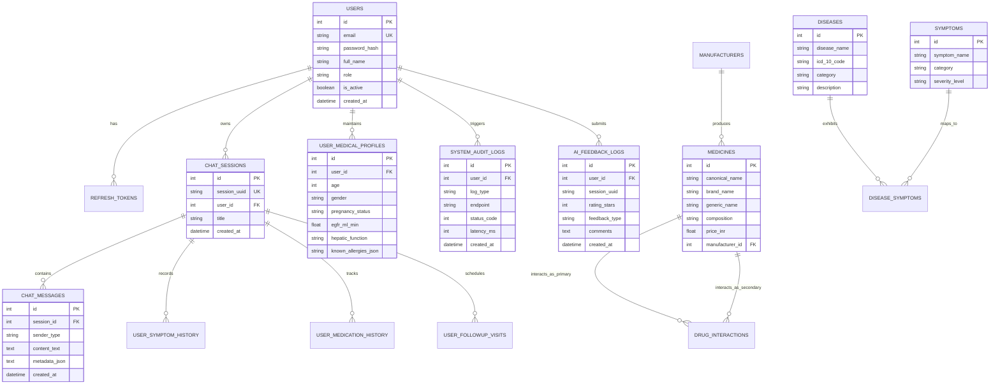

# AuraMed AI — Entity Relationship (ER) Diagram 🗄️

```mermaid
erDiagram
    USERS ||--o{ REFRESH_TOKENS : has
    USERS ||--o{ CHAT_SESSIONS : owns
    USERS ||--o{ USER_MEDICAL_PROFILES : maintains
    USERS ||--o{ SYSTEM_AUDIT_LOGS : triggers
    USERS ||--o{ AI_FEEDBACK_LOGS : submits

    CHAT_SESSIONS ||--o{ CHAT_MESSAGES : contains
    CHAT_SESSIONS ||--o{ USER_SYMPTOM_HISTORY : records
    CHAT_SESSIONS ||--o{ USER_MEDICATION_HISTORY : tracks
    CHAT_SESSIONS ||--o{ USER_FOLLOWUP_VISITS : schedules

    MANUFACTURERS ||--o{ MEDICINES : produces
    MEDICINES ||--o{ DRUG_INTERACTIONS : interacts_as_primary
    MEDICINES ||--o{ DRUG_INTERACTIONS : interacts_as_secondary
    DISEASES ||--o{ DISEASE_SYMPTOMS : exhibits
    SYMPTOMS ||--o{ DISEASE_SYMPTOMS : maps_to

    USERS {
        int id PK
        string email UK
        string password_hash
        string full_name
        string role
        boolean is_active
        datetime created_at
    }

    USER_MEDICAL_PROFILES {
        int id PK
        int user_id FK
        int age
        string gender
        string pregnancy_status
        float egfr_ml_min
        string hepatic_function
        string known_allergies_json
    }

    MEDICINES {
        int id PK
        string canonical_name
        string brand_name
        string generic_name
        string composition
        float price_inr
        int manufacturer_id FK
    }

    DISEASES {
        int id PK
        string disease_name
        string icd_10_code
        string category
        string description
    }

    SYMPTOMS {
        int id PK
        string symptom_name
        string category
        string severity_level
    }

    CHAT_SESSIONS {
        int id PK
        string session_uuid UK
        int user_id FK
        string title
        datetime created_at
    }

    CHAT_MESSAGES {
        int id PK
        int session_id FK
        string sender_type
        text content_text
        text metadata_json
        datetime created_at
    }

    SYSTEM_AUDIT_LOGS {
        int id PK
        int user_id FK
        string log_type
        string endpoint
        int status_code
        int latency_ms
        datetime created_at
    }

    AI_FEEDBACK_LOGS {
        int id PK
        int user_id FK
        string session_uuid
        int rating_stars
        string feedback_type
        text comments
        datetime created_at
    }
```
